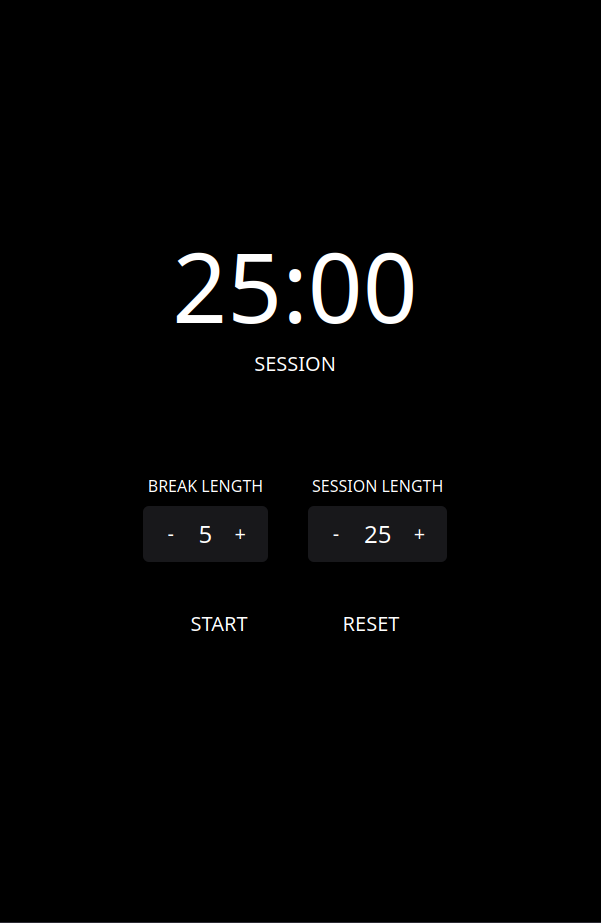

# 25+5 Clock

    

A simple 25+5 (sort-of pomodoro) clock made in [Svelte 5](https://svelte.dev/) and [Tailwind CSS](https://tailwindcss.com/).

Last certification project for the [freeCodeCamp Front End Development Libraries certification](https://www.freecodecamp.org/learn/front-end-development-libraries/)
